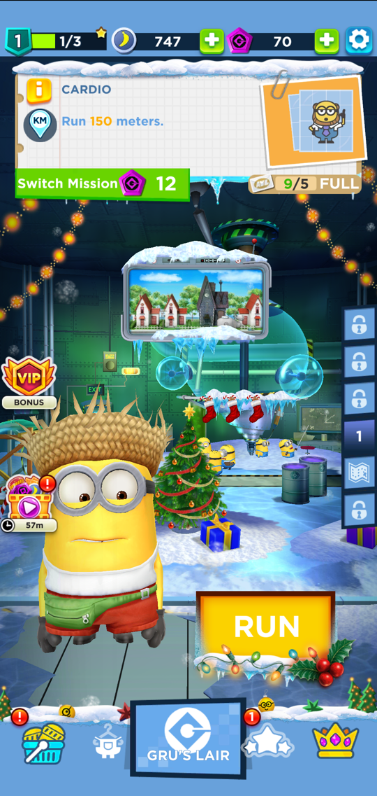
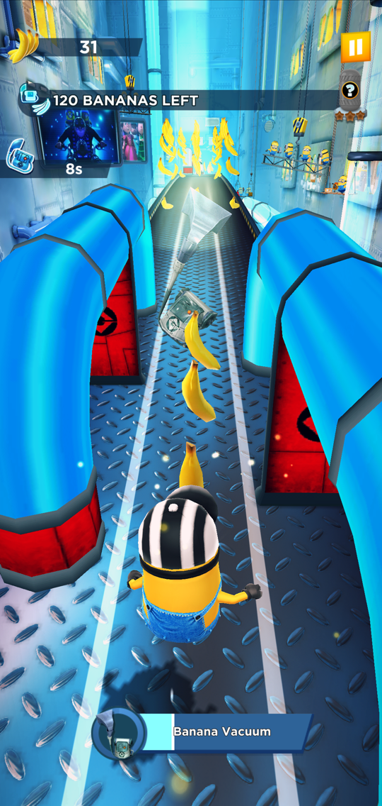
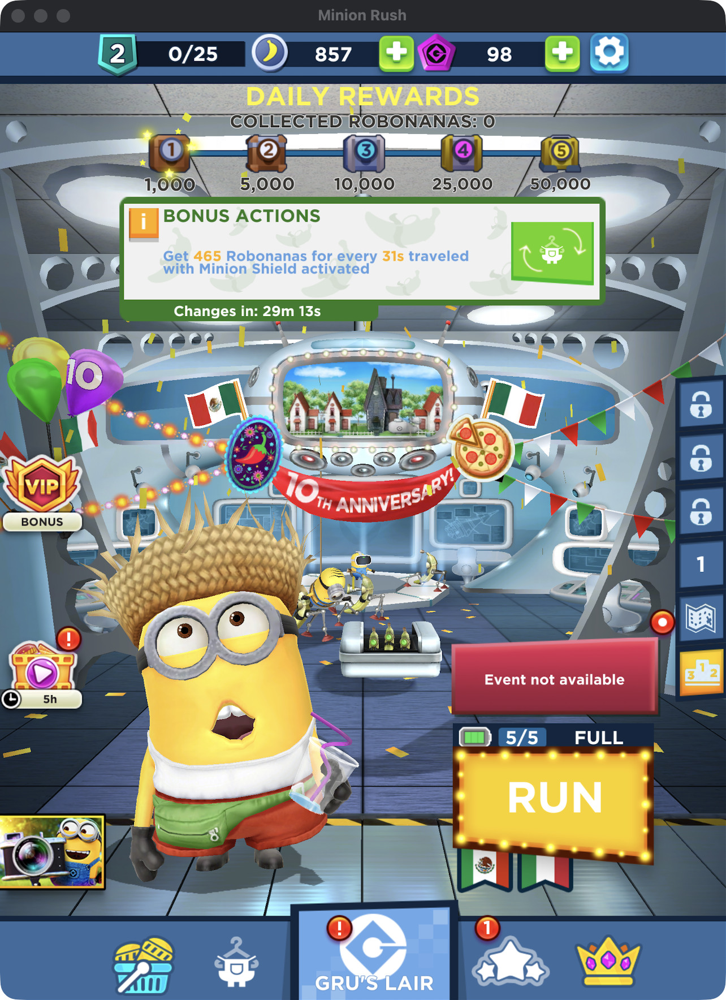
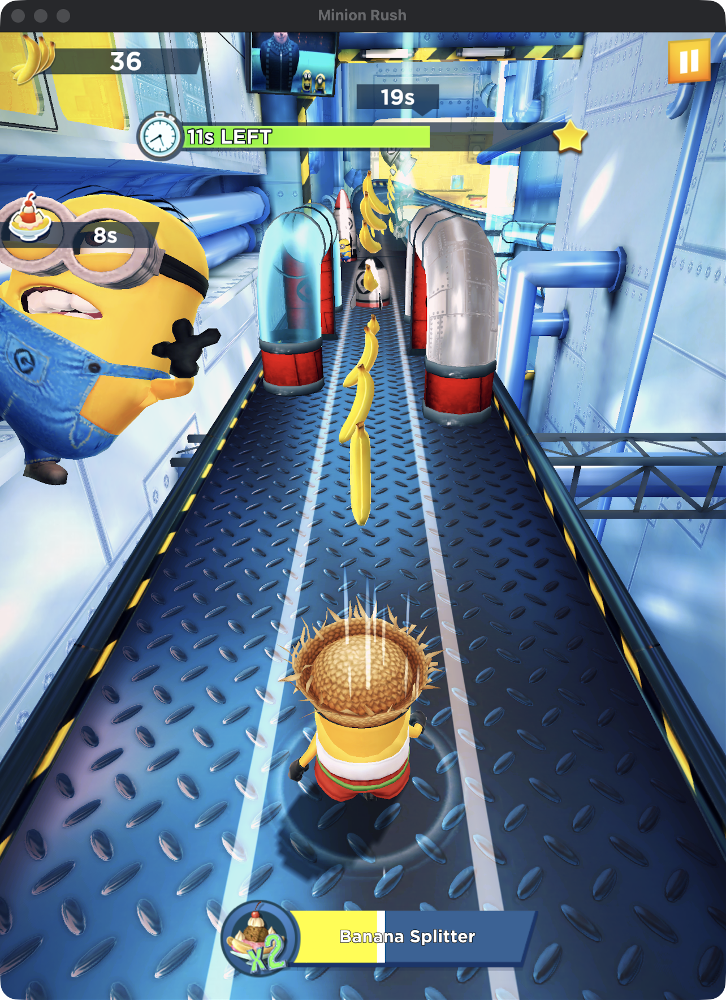

# Minion Rush Revival
### This project plans on supporting every major Minion Rush version!

Minion Rush is shutting down. These builds run on our own server, so you can keep playing. Every version uses the same server but keeps its own progress and leaderboards, so each one plays like its own game.

Join our Discord for help, updates and bug reports: https://discord.gg/8bqYUns56b
Our website: https://dotxr.github.io/minion-rush-revival/

## Versions

Download every build from the website: **https://dotxr.github.io/minion-rush-revival/**

| Version | What it is | Android | iPhone / iPad |
|---|---|---|---|
| **13.3.0** | The final Unity version (July 27th 2026 build) | APK | IPA |
| **9.7.1b** | Christmas 2023, pre-unity | APK | |
| **9.6.1b** | May 2023, pre-unity | APK | IPA |

The files are stored in parts in [Minion-Rush-Revival-Builds](https://github.com/dotxr/Minion-Rush-Revival-Builds); the site downloads the parts, checks them and puts the APK or IPA back together in your browser.

More versions are on the way. Each version installs as its own app, so you can have several at once.

### 13.3.0

  
  
  

### 9.7.1b

  
  

Running on an Android emulator.

### 9.6.1b

  
  

## Android

1. Download the APK for the version you want (see the table above) on your phone.
2. Open it, allow installing from that app when asked, then tap **Install**.

If it says the app conflicts with one you already have, uninstall the old one first.

## iPhone / iPad

1. Install [Sideloadly](https://sideloadly.io) on your computer.
2. Plug in your phone and drag the IPA for the version you want into Sideloadly. Sign in with your Apple ID and press **Start**.
3. On your phone, go to **Settings > General > VPN & Device Management** and trust your Apple ID.
4. On iOS 16 or newer, turn on **Settings > Privacy & Security > Developer Mode**.

With a free Apple ID the app stops opening after 7 days. Just sideload it again. Your save won't be lost.

## Mac

Macs with Apple Silicon can play 13.3.0 through [PlayCover](https://playcover.io), but it takes a small extra setup. See `Debugging/Frida Scripts`.

## Good to know

- Connect to the internet the first time you open the game so it can download its data.
- In 13.3.0, real-money packs are free. Tap the price button on any of them, then restart the game and the item is yours, just as if you had paid.
- Only the 13.3.0 leaderboards carry over from the real game. Older versions start fresh.
- Game Center and Google Play sign-in don't work, so your save is tied to your device.

## Disclaimer

This is an unofficial, non-commercial fan project. It isn't affiliated with or endorsed by Gameloft, Universal, Illumination or NBCUniversal. Minion Rush, Despicable Me and Minions belong to their owners. It's provided as is, with no warranty. Rights holders can open an issue to request changes or removal.
