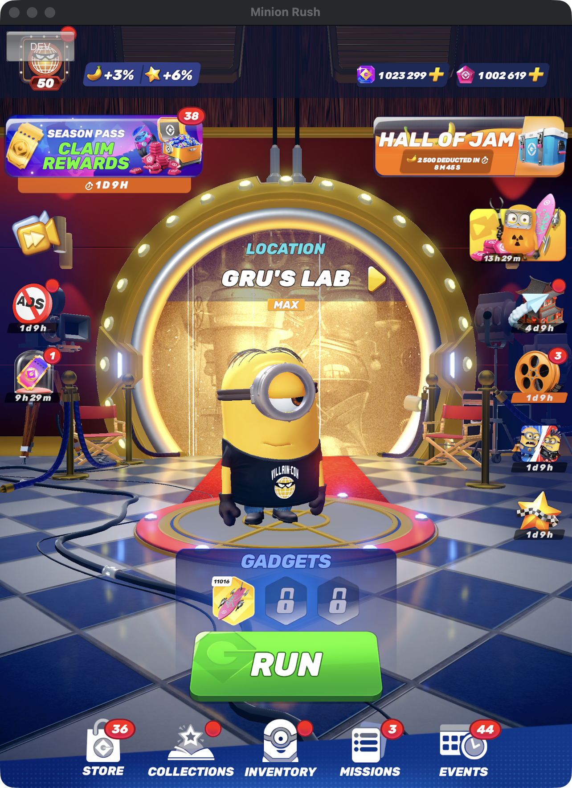
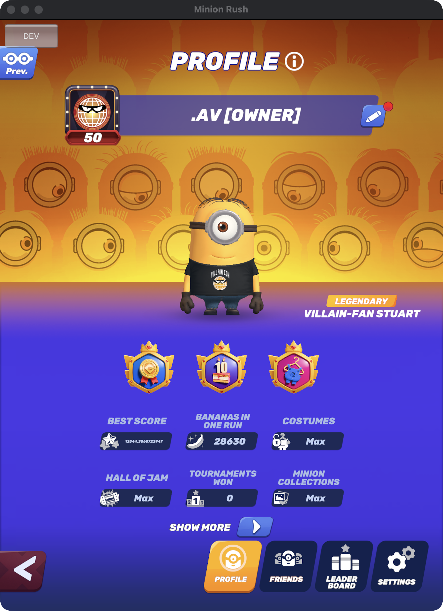
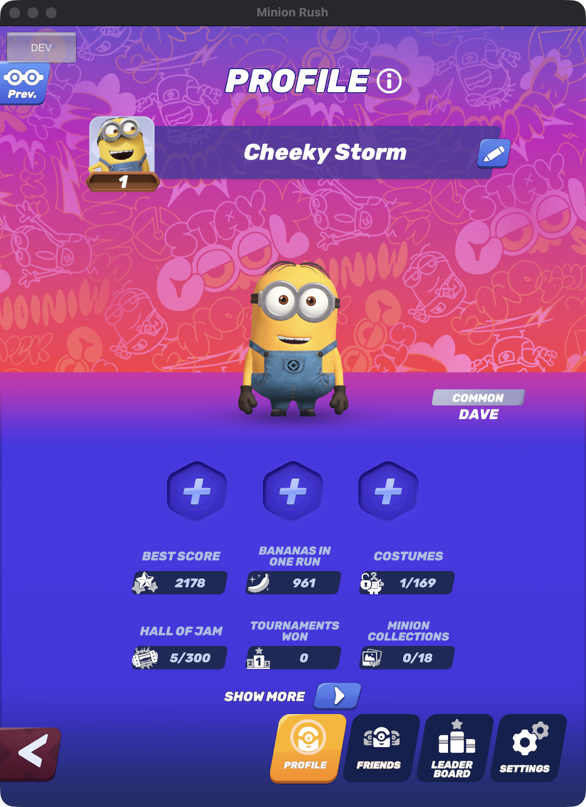

# Minion Rush Revival

Minion Rush is shutting down. This version runs on our own server, so you can keep playing.

Your progress saves, but only the leaderboards carry over from the real game.

  
  
  

## Android

1. Download [MinionRushRevived-13.3.0.apk](https://github.com/dotxr/Minion-Rush-Revival/releases/download/13.3.0/MinionRushRevived-13.3.0.apk) on your phone.
2. Open it, allow installing from that app when asked, then tap **Install**.

If it says the app conflicts with one you already have, uninstall the old one first.

## iPhone / iPad

1. Install [Sideloadly](https://sideloadly.io) on your computer.
2. Plug in your phone and drag [MinionRushRevived-13.3.0.ipa](https://github.com/dotxr/Minion-Rush-Revival/releases/download/13.3.0/MinionRushRevived-13.3.0.ipa) into Sideloadly. Sign in with your Apple ID and press **Start**.
3. On your phone, go to **Settings > General > VPN & Device Management** and trust your Apple ID.
4. On iOS 16 or newer, turn on **Settings > Privacy & Security > Developer Mode**.

With a free Apple ID the app stops opening after 7 days. Just sideload it again. Your save won't be lost.

## Mac

Macs with Apple Silicon can play through [PlayCover](https://playcover.io), but it takes a small extra setup. See `Debugging/Frida Scripts`.

## Good to know

- Connect to the internet the first time you open the game so it can download its data.
- Store purchases are free. Restart the game after buying to see your items.
- Game Center and Google Play sign-in don't work, so your save is tied to your device.

## Disclaimer

This is an unofficial, non-commercial fan project. It isn't affiliated with or endorsed by Gameloft, Universal, Illumination or NBCUniversal. Minion Rush, Despicable Me and Minions belong to their owners. It's provided as is, with no warranty. Rights holders can open an issue to request changes or removal.
